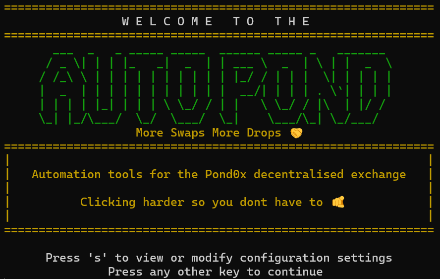
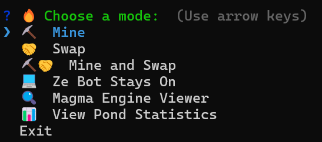

# AutoPond



AutoPond is an automation tool that interacts with the [Pond0x](https://pond0x.com) decentralized exchange to perform automated mining and token swapping operations. It leverages Puppeteer for browser automation, connects to the Phantom wallet, and uses WebSocket-based real-time monitoring to detect active mining. The tool can operate interactively via a wizard or automatically using default configurations.

## Table of Contents

- [Features](#features)
- [How It Works](#how-it-works)
  - [Initialization & Connection](#initialization--connection)
  - [Mode Selection](#mode-selection)
  - [Operation Execution](#operation-execution)
  - [Cycle Management & Logging](#cycle-management--logging)
- [Modes](#modes)
- [Configuration](#configuration)
- [Global Statistics and Session Logging](#global-statistics-and-session-logging)
- [Application Flow and Logic](#application-flow-and-logic)
- [Installation and Setup](#installation-and-setup)
- [Phantom Wallet Setup](#phantom-wallet-setup)
- [Dependencies](#dependencies)
- [Tips](#tips)
- [License](#license)
- [Contributing](#contributing)

## Features

- **Automated Mining:** Automatically mines on Pond0x when active mining conditions are detected.
- **Automated Token Swapping:** Executes token swaps based on pre-configured thresholds and amounts.
- **Interactive Wizard Mode:** Choose Mine, Swap, Mine & Swap, Magma viewer, or Stats on demand.
- **Default Headless Mode:** Run continuously or for a set number of cycles without prompts.
- **Real-Time Monitoring:** WebSocket-based mining activity detection with live and filtered logging.
- **Persistent Metrics:** Aggregate swap and mining stats in SQLite with on-demand reporting.

## How It Works

1. **Initialization & Connection**
   - Launch Puppeteer with the Phantom wallet extension loaded.
   - Navigate to **Pond0x** and connect your wallet.

2. **Mode Selection**
   - **Wizard Mode**: Interactive prompts for **Mine**, **Swap**, **Mine & Swap**, **Ze Bot Stays On**, **Magma Engine Viewer**, or **View Pond Statistics**.
   - **Default Mode**: Headlessly runs the mode and cycle count defined in `appconfig.json`.

3. **Operation Execution**
   - **Mining**:
     1. Establish a WebSocket connection (configured in `miningconfig.json`).
     2. Detect active miners → monitor hash rate & unclaimed rewards.
     3. Trigger a claim when user‑defined thresholds (hash rate, unclaimed amount, time, or boost) are met.
   - **Swapping**:
     1. Retrieve on‑chain token balances via wallet connection.
     2. Select swap amount (random or reward‑based) according to `swapconfig.json`.
     3. Simulate UI interactions to execute and confirm the swap via Phantom.

4. **Database & Logging**
   - Update persistent metrics in SQLite using `updateAggregatedSwapMetrics()` and `updateAggregatedMiningMetrics()`.
   - Optionally print session summaries and incremental vs. cumulative tables in your console.
   - Optionally log magma block engine summaries to a log file

_See [Application Flow and Logic](#application-flow-and-logic) for full details._

## Modes



### Wizard Mode

When `wizardMode` is `true` in **appconfig.json**, you’ll see an interactive menu:

- **⛏️ Mine**: Run N mining cycles using `miningconfig.json` settings.
- **🤝 Swap**: Run N swap cycles using `swapconfig.json` settings.
- **⛏️🤝 Mine & Swap**: Run mining then swap for N rounds.
- **💻 Ze Bot Stays On**: Continuous headless run of your default mode.
- **🔍 Magma Engine Viewer**: Launch live WebSocket diagnostics (see below).
- **📊 View Pond Statistics**: Print aggregated swap/mining tables.
- **Exit**: Quit the application.

> After selecting Mine/Swap/Mine & Swap, you’ll input a positive integer for rounds.

#### Delays & Retries

Controlled by `miningconfig.json` & `swapconfig.json`:

- `initialDelayMs`, `popupDelayMs`, `activeMiningRetryDelayMs`
- `miningLoopFailRetryDelayMs`, `miningSuccessDelayMs`, `loopIterationDelayMs`
- `swapDelayRange`, `swapRoundDelayRange`
- Flags: `skipMiningIfInactive`, `skipMiningOnFailure`, `skipSwapIfNoRewards`

---

### Default Mode

When `wizardMode` is `false`, AutoPond runs immediately:

- **Operation**: `appconfig.defaultMode` (`"Mine"`, `"Swap"`, or `"Mine and Swap"`).
- **Cycles**: `appconfig.defaultCycleCount` (`0` = infinite).
- **Behavior**: Applies all delays, retries, and optional boosting logic (`boostHash`, `boostHashAmountPerSession`).

---

### Ze Bot Stays On Mode

Always‑on, infinite loop of your default operation:

- Auto-reconnects WebSocket on errors.
- Relaunches browser on crashes.
- Ideal for 24/7 headless deployment.

> Stop with **Ctrl+C** or select **Exit** in the wizard.

---

### Magma Engine Viewer

A real‑time WebSocket explorer. After launch choose one:

1. **Check Active Mining**
   - Runs for `wsconfig.activeMiningTimeout` ms.
   - Outputs: `👥 Detected X active miners…`
2. **View Miner Summary**
   - Displays top 20 miners by claimed/unclaimed/hash/boost/status.
   - Options: Refresh or Quit.
3. **View Live Miner**
   - Enter a miner key or signature.
   - Streams only that miner’s events, printing a mini‑table each update.
4. **View Live Events**
   - Select status filters (e.g. RUNNING, CLAIMING, NO FILTER).
   - Streams all matching messages in table format.

**Logging to file:**

- `wsconfig.enableRawLogging=true` → append every frame to `rawMessages.log`.
- `wsconfig.enableFilteredLogging=true` → append filtered frames to `filteredMessages.log`.
- Heartbeat every `heartbeatInterval` ms; auto‑reconnect on live‑miner mode.

> Press **Q** in any viewer to return to the main menu.

---

### View Pond Statistics

Runs `viewPondStatistics()`:

1. **Swap Metrics** (`swap_metrics` table)
   - Totals: rounds, attempts, fees, volumes, failures & error breakdown.
2. **Mining Metrics** (`mining_metrics` table)
   - Totals: rounds, claimed/unclaimed, avg hash rate, time, boost & extras.
3. **Output**: Neat console tables via `printTable()`.

> Disable with `"loggingEnabled": false` in `appconfig.json`.

## Configuration

Edit the JSON files in the root:

- **appconfig.json**: wizard vs default, loggingEnabled, defaultCycleCount…
- **miningconfig.json**: delays, thresholds, WebSocket URL & API key, flags…
- **swapconfig.json**: pairs[], thresholds, amount ranges, referral settings…
- **solanaconfig.json**: RPC endpoint, WPOND detection…
- **wsconfig.json**: WebSocket settings & logging flags…

### appconfig.json

This file controls high-level application behavior. Example configuration:

```json
{
  "wizardMode": true,
  "defaultMode": "Mine and Swap",
  "loggingEnabled": true,
  "defaultCycleCount": 10,
  "liveDecodedDisplayLimit": 20,
  "myRigAddresses": ["", ""],
  "watchRigAddresses": []
}
```

| Key                       | Type     | Description                                                                                   |
| ------------------------- | -------- | --------------------------------------------------------------------------------------------- |
| `wizardMode`              | Boolean  | If `true`, run in interactive wizard mode; otherwise use defaults.                            |
| `defaultMode`             | String   | Default operation when wizard mode is off. Options: `"Mine"`, `"Swap"`, or `"Mine and Swap"`. |
| `loggingEnabled`          | Boolean  | Enable detailed logging & session statistics.                                                 |
| `defaultCycleCount`       | Number   | Number of cycles to run in default mode. `0` means run indefinitely.                          |
| `liveDecodedDisplayLimit` | Number   | Max WebSocket events to show in **Live Events** before discarding older entries.              |
| `myRigAddresses`          | String[] | Your miner addresses—preselected in views and filters.                                        |
| `watchRigAddresses`       | String[] | Additional miner addresses to monitor alongside your own.                                     |

### miningconfig.json

This file contains settings specific to mining operations and timing.

```json
{
  "initialDelayMs": 4000,
  "popupDelayMs": 3000,
  "activeMiningRetryDelayMs": 30000,
  "miningLoopFailRetryDelayMs": 60000,
  "miningSuccessDelayMs": 14400000,
  "maxIterations": 30,
  "loopIterationDelayMs": 30000,
  "miningCompleteHashRate": 0,
  "miningCompleteUnclaimedThreshold": 100000000,
  "claimMaxThreshold": 500000000,
  "claimTimeThreshold": 120,
  "claimBoostThreshold": 30,
  "mineButtonTrigger": "MINE",
  "confirmButtonText": "Confirm",
  "stopClaimButtonText": "STOP & CLAIM",
  "stopAnywayButtonText": "STOP ANYWAY",
  "wss": "wss://vkqjvwxzsxilnsmpngmc.supabase.co/realtime/v1/websocket?apikey=...&eventsPerSecond=5&vsn=1.0.0",
  "apiKey": "YOUR_API_KEY_HERE",
  "requiredActiveMiners": 10,
  "skipMiningIfInactive": true,
  "skipMiningOnFailure": true,
  "boostHash": true,
  "boostHashAmountPerSession": 0.1
}
```

| Key                                | Type    | Description                                                                                            |
| ---------------------------------- | ------- | ------------------------------------------------------------------------------------------------------ |
| `initialDelayMs`                   | Number  | Delay before starting the mining process after establishing connection (ms).                           |
| `popupDelayMs`                     | Number  | Delay after triggering the Phantom wallet popup before proceeding (ms).                                |
| `activeMiningRetryDelayMs`         | Number  | Delay before retrying active‑mining detection when none is found (ms).                                 |
| `miningLoopFailRetryDelayMs`       | Number  | Delay before restarting the mining loop after a critical failure or error (ms).                        |
| `miningSuccessDelayMs`             | Number  | Delay (e.g., 4 hours = 14 400 000 ms) to wait after a successful claim before starting the next cycle. |
| `maxIterations`                    | Number  | Maximum iterations allowed within a single mining session loop.                                        |
| `loopIterationDelayMs`             | Number  | Interval between consecutive on-screen value reads (hash rate, unclaimed tokens) in ms.                |
| `miningCompleteHashRate`           | Number  | Hash rate threshold signaling “complete” mining, triggering a standard claim.                          |
| `miningCompleteUnclaimedThreshold` | Number  | Unclaimed token threshold to trigger a standard claim.                                                 |
| `claimMaxThreshold`                | Number  | If unclaimed tokens ≥ this value, force an immediate claim.                                            |
| `claimTimeThreshold`               | Number  | Time threshold (seconds) to force a claim even if token thresholds haven’t been met.                   |
| `claimBoostThreshold`              | Number  | Boost threshold: if boost events ≥ this value, trigger an immediate claim.                             |
| `mineButtonTrigger`                | String  | Label of the on-page “Mine” button used to initiate mining.                                            |
| `confirmButtonText`                | String  | Label of the Phantom “Confirm” button in the wallet popup.                                             |
| `stopClaimButtonText`              | String  | Label of the in-page “STOP & CLAIM” button.                                                            |
| `stopAnywayButtonText`             | String  | Label of the in-page “STOP ANYWAY” button.                                                             |
| `wss`                              | String  | WebSocket URL for real-time mining activity detection (including eventsPerSecond & version params).    |
| `apiKey`                           | String  | API key used to authenticate with the WebSocket server.                                                |
| `requiredActiveMiners`             | Number  | Number of required active miners for detection logic.                                                  |
| `skipMiningIfInactive`             | Boolean | If `true`, skip mining when no activity is detected; if `false`, retry until detection.                |
| `skipMiningOnFailure`              | Boolean | If `true`, abort on critical failures instead of retrying.                                             |
| `boostHash`                        | Boolean | Enable hash-boosting behavior between sessions.                                                        |
| `boostHashAmountPerSession`        | Number  | Amount of boost (work units) to apply each session when `boostHash` is enabled.                        |

### swapconfig.json

**IMPORTANT:** You must have some of the token in your wallet for the token slection to work correctly!

This file configures the token swap operations. An example configuration might include:

```json
{
  "pairs": [
    {
      "tokenA": "USDC",
      "tokenB": "SOL",
      "tokenAMint": "EPjFWdd5AufqSSqeM2qN1xzybapC8G4wEGGkZwyTDt1v",
      "tokenBMint": "So11111111111111111111111111111111111111112",
      "tokenALowThreshold": 10,
      "tokenBLowThreshold": 0.1,
      "tokenAMinAmount": 10,
      "tokenAMaxAmount": 12,
      "tokenBMinAmount": 0.09,
      "tokenBMaxAmount": 0.1,
      "tokenARewardMin": 10,
      "tokenARewardMax": 12,
      "tokenBRewardMin": 0.08,
      "tokenBRewardMax": 0.1
    },
    {
      "tokenA": "USDT",
      "tokenB": "SOL",
      "tokenAMint": "Es9vMFrzaCERmJfrF4H2FYD4KCoNkY11McCe8BenwNYB",
      "tokenBMint": "So11111111111111111111111111111111111111112",
      "tokenALowThreshold": 10,
      "tokenBLowThreshold": 0.1,
      "tokenAMinAmount": 10,
      "tokenAMaxAmount": 12,
      "tokenBMinAmount": 0.09,
      "tokenBMaxAmount": 0.1,
      "tokenARewardMin": 10,
      "tokenARewardMax": 12,
      "tokenBRewardMin": 0.08,
      "tokenBRewardMax": 0.1
    }
  ],
  "maxReferralFee": "0.000007",
  "swapRounds": 10,
  "swapRewardsActive": false,
  "enableRewardsCheck": false,
  "skipSwapIfNoRewards": false,
  "useReferralList": true,
  "turboswap": false,
  "swapDelayRange": [10000, 12000],
  "swapRoundDelayRange": [15000, 20000]
}
```

| Key                   | Type     | Description                                                                     |
| --------------------- | -------- | ------------------------------------------------------------------------------- |
| `pairs`               | Array    | List of token-pair configurations, each specifying swap thresholds and amounts. |
| `maxReferralFee`      | String   | Maximum referral fee per swap, in SOL units.                                    |
| `swapRounds`          | Number   | Number of swap attempts per session.                                            |
| `swapRewardsActive`   | Boolean  | Whether to use reward-based amounts instead of random ranges.                   |
| `enableRewardsCheck`  | Boolean  | If `true`, checks on-chain reward transfers before swapping.                    |
| `skipSwapIfNoRewards` | Boolean  | If `true`, skips the swap when no rewards are detected.                         |
| `useReferralList`     | Boolean  | If `true`, routes swaps through saved referral addresses when eligible.         |
| `turboswap`           | Boolean  | Enable the turbo swap UI for faster execution, if supported.                    |
| `swapDelayRange`      | Number[] | `[minMs, maxMs]` delay between individual swap steps, randomly selected.        |
| `swapRoundDelayRange` | Number[] | `[minMs, maxMs]` delay between full swap rounds, randomly selected.             |

**Each object in `pairs` includes:**

| Key                                       | Type   | Description                                                       |
| ----------------------------------------- | ------ | ----------------------------------------------------------------- |
| `tokenA`/`tokenB`                         | String | Symbols of the two tokens in the pair (e.g., "USDC", "SOL").      |
| `tokenAMint`/`tokenBMint`                 | String | On-chain mint addresses for each token.                           |
| `tokenALowThreshold`/`tokenBLowThreshold` | Number | Minimum balance thresholds for swaps or flips.                    |
| `tokenAMinAmount`/`tokenAMaxAmount`       | Number | Min/max amounts for random swaps when reward mode is inactive.    |
| `tokenBMinAmount`/`tokenBMaxAmount`       | Number | Min/max amounts for random swaps when reward mode is inactive.    |
| `tokenARewardMin`/`tokenARewardMax`       | Number | Min/max amounts when reward mode (`swapRewardsActive`) is `true`. |
| `tokenBRewardMin`/`tokenBRewardMax`       | Number | Min/max amounts when reward mode (`swapRewardsActive`) is `true`. |

_Note: Adjust or extend the `swapconfig.json` file as needed for your specific swapping requirements._

### solanaconfig.json

This configuration file is used to connect to the Solana blockchain and configure the rewards detector. It specifies the RPC endpoint for accessing the Solana network and sets parameters related to WPOND transfer monitoring for reward detection. An example configuration might include:

```json
{
  "rpcEndpoint": "https://api.mainnet-beta.solana.com",
  "wpondTransferTimeThreshold": 900,
  "rewardsWalletAddress": "1orFCnFfgwPzSgUaoK6Wr3MjgXZ7mtk8NGz9Hh4iWWL",
  "wpondTokenMint": "3JgFwoYV74f6LwWjQWnr3YDPFnmBdwQfNyubv99jqUoq",
  "discountWalletAddresses": ["AYg4dKoZJudVkD7Eu3ZaJjkzfoaATUqfiv8w8pS53opT"]
}
```

| Key                          | Type     | Description                                                                                           |
| ---------------------------- | -------- | ----------------------------------------------------------------------------------------------------- |
| `rpcEndpoint`                | String   | The URL of the Solana RPC endpoint used to connect to the Solana network.                             |
| `wpondTransferTimeThreshold` | Number   | Maximum time (in seconds) to consider a WPOND transfer as recent for reward detection.                |
| `rewardsWalletAddress`       | String   | The address of the wallet that receives WPOND transfers and is monitored for reward-based operations. |
| `wpondTokenMint`             | String   | The mint address of the WPOND token on Solana.                                                        |
| `discountWalletAddresses`    | String[] | Addresses excluded from rewards detection (e.g., internal or discounted wallets).                     |
|                              |

### wsconfig.json

```json
{
  "wss": "wss://vkqjvwxzsxilnsmpngmc.supabase.co/realtime/v1/websocket?apikey=YOUR_API_KEY&eventsPerSecond=5&vsn=1.0.0",
  "apiKey": "YOUR_API_KEY",
  "heartbeatInterval": 3000,
  "maxReconnectDelay": 10000,
  "activeMiningTimeout": 30000,
  "requiredActiveMiners": 5,
  "activityThresholdSeconds": 60,
  "enableRawLogging": false,
  "enableFilteredLogging": false
}
```

| Key                        | Type    | Description                                                                                                                         |
| -------------------------- | ------- | ----------------------------------------------------------------------------------------------------------------------------------- |
| `wss`                      | String  | WebSocket URL for mining-activity detection (includes `apikey`, `eventsPerSecond`, and protocol version parameters).                |
| `apiKey`                   | String  | API key for authenticating with the WebSocket server.                                                                               |
| `heartbeatInterval`        | Number  | Interval in milliseconds between Phoenix heartbeat messages to keep the connection alive.                                           |
| `maxReconnectDelay`        | Number  | Maximum delay in milliseconds before attempting to reconnect after an unexpected socket closure.                                    |
| `activeMiningTimeout`      | Number  | Timeout in milliseconds for the **Check Active Mining** command before it aborts and reports inactivity.                            |
| `requiredActiveMiners`     | Number  | Number of active miners that must be detected by the WebSocket before considering the pool “active.”                                |
| `activityThresholdSeconds` | Number  | Maximum age in seconds of a miner’s last activity timestamp to still count as “active.”                                             |
| `enableRawLogging`         | Boolean | If `true`, writes every incoming raw WebSocket message to the `rawMessages.log` file.                                               |
| `enableFilteredLogging`    | Boolean | If `true`, writes only messages passing the active filter to the filtered-log file, reducing log volume and focusing on key events. |

## Database

AutoPond persists performance metrics in a local SQLite database (`appMetrics.db`), maintained across runs:

### Swap Metrics

Updated each cycle by `updateAggregatedSwapMetrics()`, tracked in the `swap_metrics` table:

- **Total Swap Rounds**
- **Successful / Failed / Aborted Swap Rounds**
- **Total Swap Attempts**
- **Total Transaction Fees (SOL)**
- **Volume by Token** (e.g. USDC, SOL)
- **Swaps by Token Pair** (e.g. USDC-SOL)
- **Referral Fees by Token**
- **Pre‑Sign Failures** (`insufficient`, `userAbort`, `other`)
- **Post‑Sign Failures** (`slippageTolerance`, `transactionReverted`, `other`)
- **Extra Swap Errors** (any additional error categories)

### Mining Metrics

Updated each session by `updateAggregatedMiningMetrics()`, stored in the `mining_metrics` table:

- **Total Mining Rounds**
- **Successful vs. Failed Rounds**
- **Total Claimed Amount**
- **Total Unclaimed Amount**
- **Average Hash Rate**
- **Total Mining Time (min)**
- **Boost** (average across sessions)
- **Extra Mining Data** (e.g. loop iterations, custom counters)

ip:\*\* Set `"loggingEnabled": false` in `appconfig.json` to suppress these console reports.

## What AutoPond Monitors

- **Mining Activity**

  - Active‑miner count via WebSocket
  - Real‑time hash rate (current & average)
  - Unclaimed token amount (current & incremental)
  - Claim triggers (hash‑rate thresholds, unclaimed thresholds, time‑based, boost‑count)
  - Boost events and total boost applied per session
  - Loop iteration count and per‑iteration delay
  - Session duration (minutes)
  - Success vs. failure of each claim round

- **Swap Activity**

  - On‑chain token balances (SOL & SPL) for each pair
  - Balance‑threshold checks and automatic “flip” between token A ↔ B
  - Swap amount selection (standard vs. reward‑based)
  - Total swap rounds, successful / failed / aborted counts
  - Pre‑sign failures (insufficient funds, user abort, other)
  - Post‑sign failures (slippage tolerance, transaction reverted, other)
  - Volume swapped per token
  - Referral fees collected per token
  - Total transaction fees paid (SOL)
  - Any extra swap errors encountered

- **Application Health & Resilience**

  - WebSocket connection status and reconnect attempts
  - Browser launch/closure events (Puppeteer)
  - Phantom wallet connection success/failures
  - Automatic retry counts for mining & swap loops
  - Any uncaught errors during cycles

- **Persistent Aggregates (SQLite)**
  - Cumulative metrics in `swap_metrics` and `mining_metrics` tables
  - On‑demand “View Pond Statistics” console summaries

## Application Flow and Logic

### Mining Flow Logic

1. **Active Mining Detection**

   - Establish a WebSocket connection using `miningconfig.wss` and authenticate with `miningconfig.apiKey`.
   - If no active miners are found and `skipMiningIfInactive` is `true`, skip the entire mining phase; otherwise wait `activeMiningRetryDelayMs` and recheck.

2. **Initial Delay & Popup**

   - Wait `initialDelayMs`.
   - Trigger the on‑page “Mine” button and Phantom popup via `handlephanpopup()`.
   - Wait `popupDelayMs`.

3. **Mining Session Loop**  
   Repeat until a claim/stop condition is met:

   - **Read LCD** every `loopIterationDelayMs` via `updatelcd()`, parsing `TIME`, `HASHRATE`, `UNCLAIMED`, and `BOOST`.
   - **Update Metrics** (`updateMetrics()`):
     - Compute `unclaimedIncrement`, reset on reward.
     - Recalculate `avgHashRate`, `miningTimeMin`, `miningTimeIncrement`.
     - Track `maxBoost` and register first boost after 5 iterations.
     - Flush to SQLite via `updateAggregatedMiningMetrics()`.
   - **Hash‑Boost**: once after iteration ≥ 1 if `boostHash = true`, call `triggerBoostAndSign()` then disable further boosts this session.
   - **Evaluate Claim Conditions** (`checkClaimConditions()`):
     1. **Max Iterations** (`iterationCount > maxIterations`) → forced claim if `unclaimed ≥ miningCompleteUnclaimedThreshold`.
     2. **Max Threshold** (`unclaimed ≥ claimMaxThreshold`) → forced claim.
     3. **Zero‑Hash Start** (hashRate = 0 after ≥ 5 checks) → stop without claiming.
     4. **Time Threshold** (`TIME ≥ claimTimeThreshold`) → claim if `unclaimed ≥ miningCompleteUnclaimedThreshold`, else stop.
     5. **Standard Claim** (hashRate = miningCompleteHashRate **and** `unclaimed > miningCompleteUnclaimedThreshold`).
     6. **Boost Drop** (after ≥ 5 iterations, `BOOST < maxBoost`) → claim.
   - If no condition fires, wait `loopIterationDelayMs` before next iteration.

4. **Post‑Session Delay & Finalization**
   - After a claim or stop, wait `miningSuccessDelayMs`.
   - Mark final metrics (`incrementalExtraData.final = 1`) and flush one last `updateAggregatedMiningMetrics()`.
   - **Note:** Each session’s metrics (claimed amounts, hash rates, durations, boosts) persist in the `mining_metrics` table.

### Swap Flow Logic

1. **UI Initialization & Wallet Connection**

   - Navigate to the swap page and wait for it to load.
   - Trigger Phantom connect popup via `connectwallet()`, retrieve public key.

2. **Rewards Check**

   - If `enableRewardsCheck = true`, call `checkRecentWpondTransfer()` against Solana RPC.
   - Set `swapRewardsActive` accordingly; if no rewards and `skipSwapIfNoRewards = true`, exit early.

3. **Token & Amount Setup**

   - Identify `tokenA`, `tokenB`, their mints, and low‑balance thresholds.
   - In each round, `runTokenManager()` will:
     - Fetch on‑chain balance (`getSolBalance`/`getSplBalance`).
     - If balance < threshold, swap roles (`flipTokenDirection()`).
     - Pick amount from either `[min, max]` or `[rewardMin, rewardMax]` based on `swapRewardsActive`.

4. **Swap Rounds Loop**  
   For `round = 1…swapRounds`:

   - **Attempt up to 3 times**:
     1. Simulate UI clicks (`inputTokenSelect()`, `outputTokenSelect()`) unless `turboswap` flags block re‑selection.
     2. `setSwapAmount()` + `signtxloop()` to confirm via Phantom.
     3. On failure, record `preSignFailures` or `postSignFailures`, re‑run token manager, retry.
   - **Success Path**:
     - Wait for Solscan link, print OSC8 hyperlink.
     - Fetch and parse the on‑chain transaction to extract fees and referral amounts via `printSwapSummary()`.
   - Persist each round’s metrics with `updateAggregatedSwapMetrics()`.
   - Wait `swapDelayRange` before next round.

5. **Round Completion**
   - After all rounds, wait `swapRoundDelayRange`, then call `accumulateSwapMetrics()` and display a summary via `printSessionEndReport()`.

### Rewards Detector Logic

1. **Connect & Fetch**

   - Use `solanaconfig.rpcEndpoint` to fetch recent signatures for `rewardsWalletAddress`.

2. **Validate Transfers**

   - Filter for `wpondTokenMint` transfers within `wpondTransferTimeThreshold`.
   - Exclude any `discountWalletAddresses`.

3. **Activate Reward Mode**
   - If a valid transfer is found, set `swapRewardsActive = true`; swap logic will then use reward‑based amount ranges.

### Claim Conditions

Evaluated in every mining loop iteration:

- **Standard Claim**:  
  `hashRate === miningCompleteHashRate` **and** `unclaimed > miningCompleteUnclaimedThreshold`.
- **Forced Claim**:  
  `unclaimed ≥ claimMaxThreshold`.
- **Time‑Based Claim**:  
  `TIME ≥ claimTimeThreshold` **and** `unclaimed ≥ miningCompleteUnclaimedThreshold`.
- **Boost Drop**:  
  After ≥ 5 checks, if `BOOST < maxBoost`.
- **Max Iterations**:  
  Iterations > `maxIterations` with optional forced claim.

If none apply, the bot waits `loopIterationDelayMs` and re‑evaluates.

### Overall Flow

1. **Initialization**

   - Load `.env`, JSON configs, and set up SQLite & logging.
   - Launch Puppeteer + Phantom extension; navigate to Pond0x.

2. **Mode Selection**

   - **Wizard Mode** (`wizardMode = true`): interactive menu.
   - **Default Mode** (`wizardMode = false`): headless run of `defaultMode` for `defaultCycleCount` (0 = infinite).
   - **Ze Bot Stays On**: headless infinite loop with auto‑reconnects and relaunch on errors.

3. **Operation Execution**

   - Invoke mining (`MiningSession.start()`), swapping (`swappond()`), or combined (`Mine and Swap`) per selected mode.

4. **Cycle Management**

   - Between full mining sessions: wait `miningSuccessDelayMs`.
   - Between swap rounds: wait `swapRoundDelayRange`.

5. **Logging & Monitoring**
   - All metrics stream to SQLite (`mining_metrics`, `swap_metrics`).
   - Console output via `printMessageLinesBorderBox()` and session summaries.
   - Raw/filtered WebSocket frames optionally logged via `wsconfig` flags.y

## Installation and Setup

1. **Clone the Repository:**

   ```bash
   git clone https://github.com/your-username/your-repo.git
   cd your-repo
   ```

2. **Install Dependencies**

   Ensure you have [Node.js](https://nodejs.org/) installed on your system. Then, install the project dependencies (see dependencies section below for more details) by running:

   ```bash
   npm install
   ```

3. **Configure the Application**

   Update the configuration files in the root directory with your desired settings:

   - **appconfig.json:** Controls high-level behavior (wizard mode, default operation mode, logging, cycle delay, cycle count).
   - **miningconfig.json:** Contains settings specific to mining operations (delays, thresholds such as `miningCompleteHashRate`, `miningCompleteUnclaimedThreshold`, `claimMaxThreshold`, etc.).
   - **solanaconfig.json:** Configures Solana network access and rewards detector parameters (`rpcEndpoint`, `wpondTransferTimeThreshold`, `rewardsWalletAddress`, `wpondTokenMint`, `discountWalletAddresses`).
   - **swapconfig.json:** Defines token swapping parameters (token symbols, mint addresses, balance thresholds, possible swap amounts, reward-based swap amounts, etc.).

   Open each JSON file in your preferred text editor and modify the values as needed, ensuring the JSON is valid.

## Phantom Wallet Setup

Before using AutoPond, it's essential to set up a dedicated (burner) Phantom Wallet for automation. **Do not use your primary wallet unless you have confirmed this code is safe and you understand the risks**—this minimizes risk if your environment variables are exposed. For detailed instructions on creating a burner wallet, please refer to [this guide on setting up a new Phantom Wallet](https://support.phantom.app/hc/en-us/articles/360020005092-How-do-I-create-a-new-Phantom-wallet-).

1. **Install the Phantom Wallet Extension:**  
   Download and install the Phantom Wallet extension for Chrome from [Phantom's website](https://phantom.app).

2. **Create a Burner Wallet:**  
   After installation, open the Phantom Wallet extension and follow the on-screen instructions to create a new wallet. Save your recovery phrase securely—this wallet should be used exclusively with AutoPond.

3. **Configure Environment Variables:**  
   Rename the file `ENV_TEMPLATE` to `.env` file in the project root and modify the following variables:
   ```env
   PK="your-burner-wallet-private-key"          # Use the private key from your burner wallet
   PHANTOM_PW="your-wallet-password"             # (Optional) Your wallet's temorary password
   ```

## Security Disclaimer

**Important:**

- **Protect Your Private Keys:**  
  Never share your private key (`PK`) or wallet password (`PHANTOM_PW`) with anyone. Ensure these values are stored securely and are not committed to version control.

- **Environment Variables:**  
  Keep sensitive information such as your private key and wallet password in a secure `.env` file, and make sure this file is excluded from version control (e.g., using a `.gitignore` file).

- **Follow Best Practices:**  
  For further guidance on wallet security and how to set up a secure burner wallet, please refer to the [Phantom Wallet Security Guide](https://support.phantom.app/hc/en-us/articles/360020005092-How-do-I-create-a-new-Phantom-wallet-) or similar trusted resources.

4. **Run the Application**

   Start the application by running:

   ```bash
   npm start
   ```

## Dependencies

AutoPond relies on several libraries and tools to operate. Make sure you have [Node.js](https://nodejs.org/) (v14 or higher) installed, then install the following dependencies via npm:

- **[Puppeteer](https://pptr.dev/)** (`^23.11.1`): Used for browser automation.
- **[Inquirer](https://www.npmjs.com/package/inquirer)** (`^12.4.1`): Provides an interactive command-line interface.
- **[dotenv](https://www.npmjs.com/package/dotenv)** (`^16.4.7`): Loads environment variables from a `.env` file.
- **[@solana/web3.js](https://www.npmjs.com/package/@solana/web3.js)** (`^1.98.0`): Enables interaction with the Solana blockchain.
- **[ws](https://www.npmjs.com/package/ws)** (`^8.18.0`): Implements WebSocket functionality.
- **[tslib](https://www.npmjs.com/package/tslib)** (`^2.8.1`): Contains runtime helpers for TypeScript.
- **[TypeScript](https://www.typescriptlang.org/)** (`^5.7.2`): Used to compile the TypeScript code.
- **[@types/inquirer](https://www.npmjs.com/package/@types/inquirer)** (`^9.0.7`): Provides TypeScript definitions for Inquirer.

To install all dependencies, simply run:

```bash
npm install
```

## Tips

If you wish to support the project and the many hours of time this tool will save you (think of all the grass you can touch) then please send SOL to 3jRksPvB4EXwo737Jww5Ncd35tqw6VP3HBr31MMep9di. Thanks in advance.

## License

AutoPond is licensed under the **ISC License**.  
See the [LICENSE](LICENSE) file for details on the permissions and limitations under this license.

## Contributing

Contributions to AutoPond are welcome and appreciated! If you'd like to contribute, please follow these guidelines:

1. **Fork the Repository:**  
   Create a personal fork of the project on GitHub.

2. **Create a Feature Branch:**  
   Develop your changes in a dedicated branch (e.g., `feature/my-new-feature`).

3. **Ensure Code Quality:**

   - Follow the existing coding conventions.
   - Add tests for your changes where applicable.
   - Update documentation if needed.

4. **Submit a Pull Request:**  
   Open a pull request from your fork to the main repository. Please include a detailed description of your changes and the motivation behind them.

5. **Issues & Feature Requests:**  
   If you encounter any bugs or have suggestions for improvements, please open an issue on the [GitHub Issues](https://github.com/drewbie1234/autopond/issues) page.

Thank you for helping improve AutoPond!
